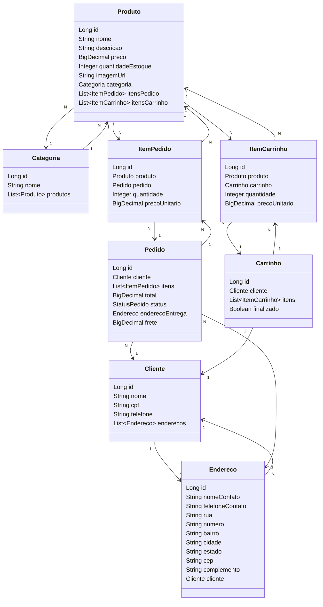

# E-COMMERCE API

## Diagrama de Classes

```mermaid
classDiagram
    class Cliente {
        Long id
        String nome
        String cpf
        String telefone
        List~Endereco~ enderecos
    }

    class Endereco {
        Long id
        String nomeContato
        String telefoneContato
        String rua
        String numero
        String bairro
        String cidade
        String estado
        String cep
        String complemento
        Cliente cliente
    }

    class Produto {
        Long id
        String nome
        String descricao
        BigDecimal preco
        Integer quantidadeEstoque
        String imagemUrl
        Categoria categoria
        List~ItemPedido~ itensPedido
        List~ItemCarrinho~ itensCarrinho
    }

    class Categoria {
        Long id
        String nome
        List~Produto~ produtos
    }

    class Pedido {
        Long id
        Cliente cliente
        List~ItemPedido~ itens
        BigDecimal total
        StatusPedido status
        Endereco enderecoEntrega
        BigDecimal frete
    }

    class ItemPedido {
        Long id
        Produto produto
        Pedido pedido
        Integer quantidade
        BigDecimal precoUnitario
    }

    class Carrinho {
        Long id
        Cliente cliente
        List~ItemCarrinho~ itens
        Boolean finalizado
    }

    class ItemCarrinho {
        Long id
        Produto produto
        Carrinho carrinho
        Integer quantidade
        BigDecimal precoUnitario
    }

    %% Relações
    Cliente "1" --> "N" Endereco
    Endereco "N" --> "1" Cliente

    Categoria "1" --> "N" Produto
    Produto "N" --> "1" Categoria

    Pedido "1" --> "N" ItemPedido
    Pedido "N" --> "1" Cliente
    Pedido "N" --> "1" Endereco

    ItemPedido "N" --> "1" Produto
    ItemPedido "N" --> "1" Pedido

    Carrinho "1" --> "N" ItemCarrinho
    Carrinho "1" --> "1" Cliente

    ItemCarrinho "N" --> "1" Produto
    ItemCarrinho "N" --> "1" Carrinho

    Produto "1" --> "N" ItemPedido
    Produto "1" --> "N" ItemCarrinho
```
